# **01_パソコンに慣れよう**

## **1.このコースの目的**

このコースでは、パソコンの基本操作を学びながら、  
自分の好きなものを紹介するWebサイトを作ります。  
デザインやロゴも自分で考え、  
最後にはHTMLとCSSを使って、実際に動くWebサイトを完成させます。

1. パソコンに慣れよう
2. Webデザインとは
3. HTML/CSSでプログラミング

## **2.自己紹介**

- 名前（ニックネーム　何て呼んでほしい？）
- キャンパス（住んでいるところ）
- 好きなこと

## **3.この単元でやること**

1. ZOOMの使い方
2. フォルダ・ファイル操作
3. タイピング
4. googleアカウントを作る

## **4.演習**

## 1.ZOOMの使い方

### ①ZOOM画面の下のアイコン

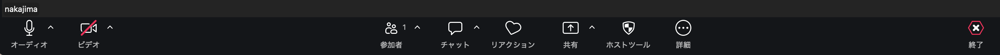

### ②画面と音声の切り替え

アイコンをクリックするとON OFFが切り替えられます  

**マイクON 画面ON**

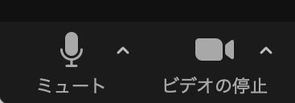

**マイクOFF 画面ON**

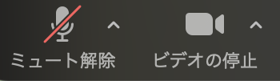

### ③リアクションボタン

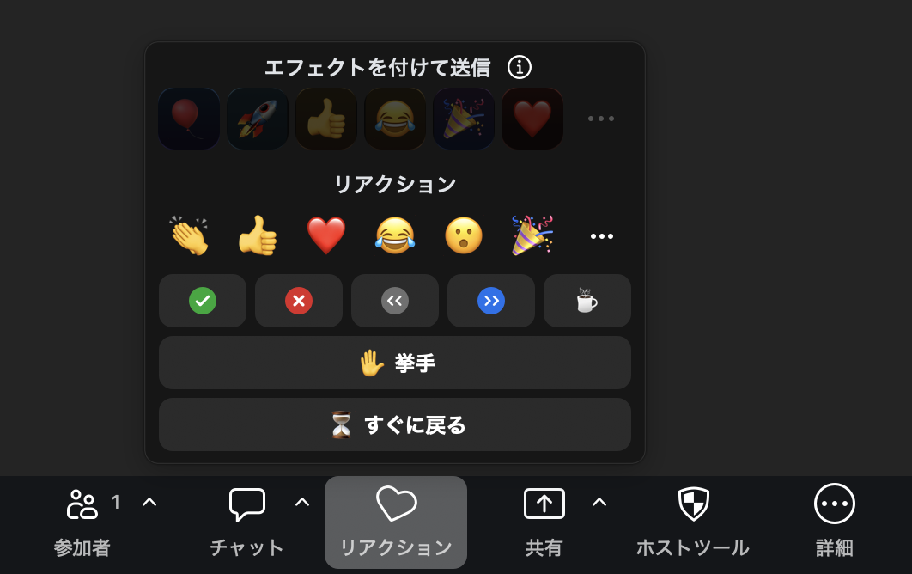

### ④画面を小さくする

キーボードの左上「ESC」キーを押す  
画面右上の「表示」の文字をクリック＞「全画面表示を終了する」  

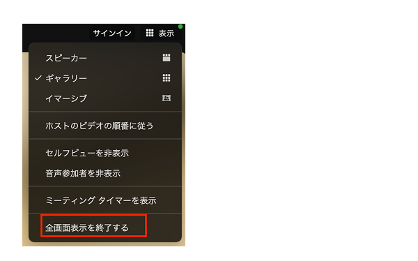

画面の端にマウスを当てると矢印が出てくる＞クリックしながら上下左右に動かすと幅が変わります  

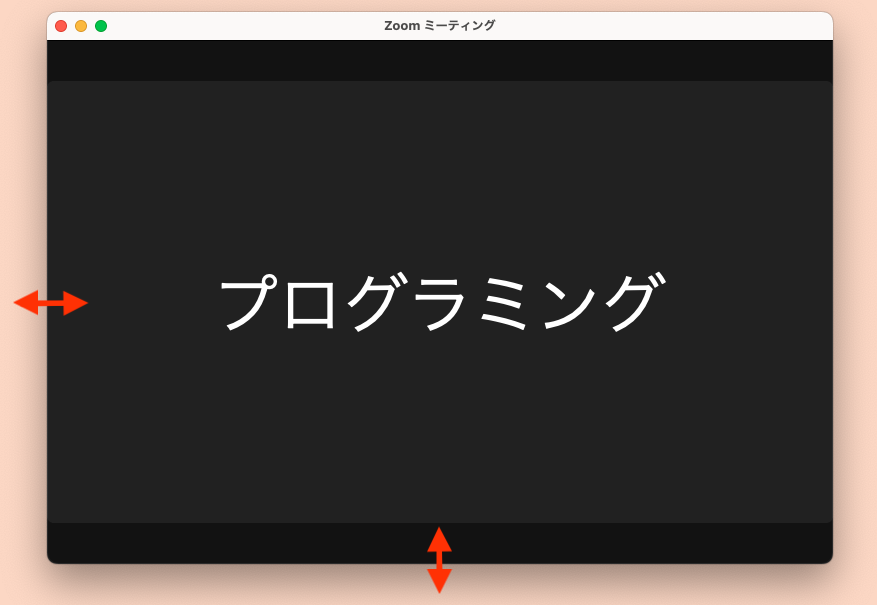

小さくして端のほうに置いておきましょう  

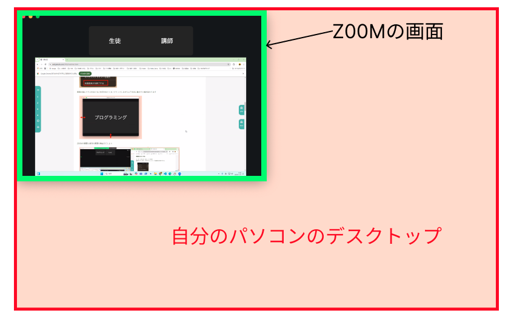

## 2.フォルダ作成・ファイル操作

### ①パソコン画面の名前を確認

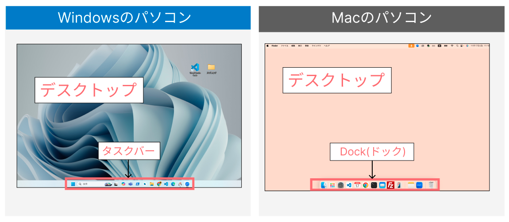

### ②フォルダを作成

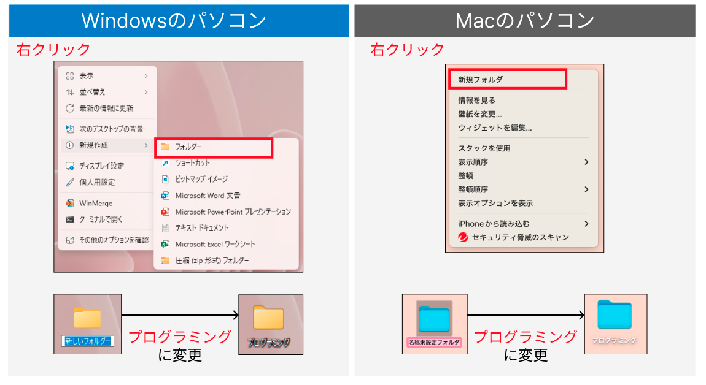

### ③ファイルを開く

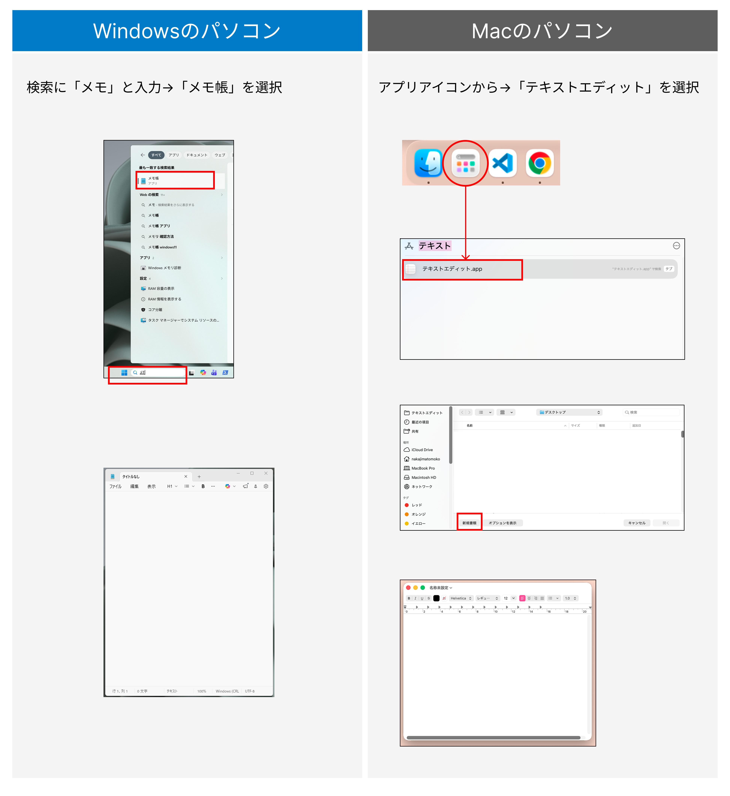

---

#### **【⭐️演習⭐️】**

自分の名前を入力しよう

---

### ④ファイルを保存、もう一度開く

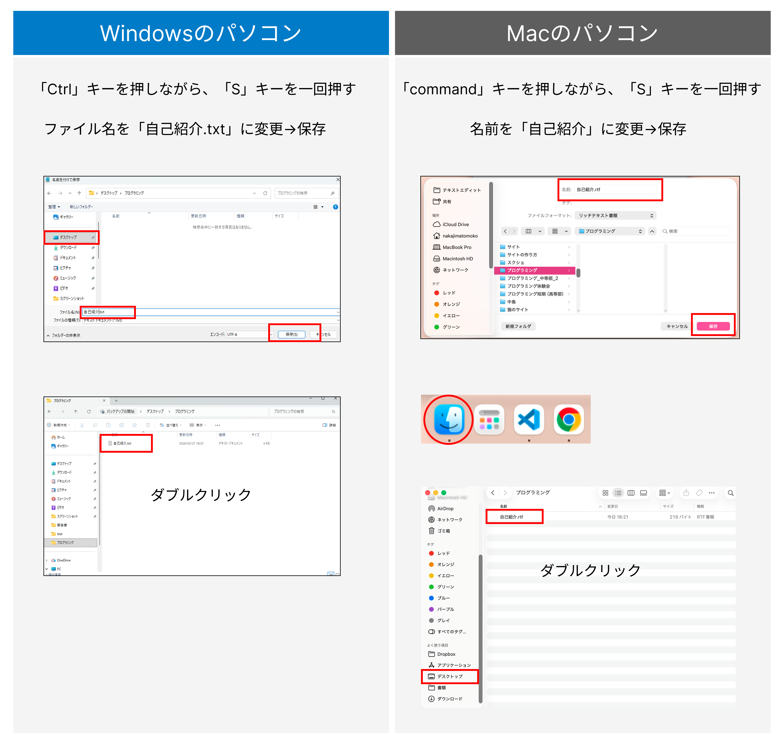

### ⑤最小化、最大化、分割

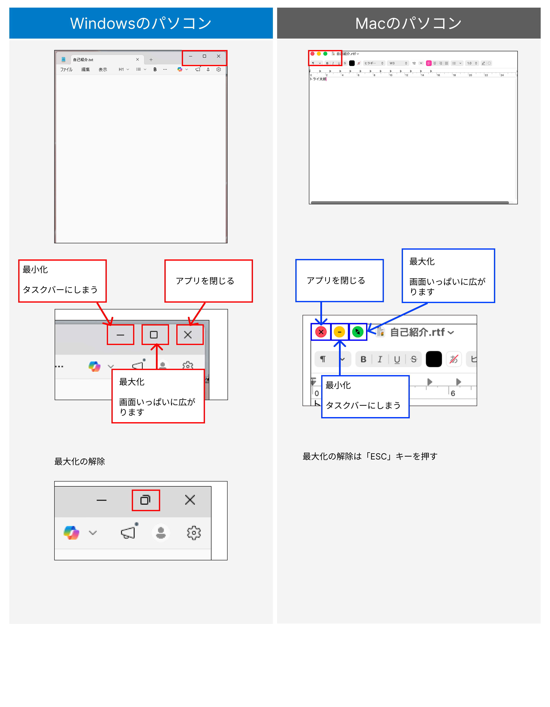

## 3.タイピングのコツ

### ①ブラインドタッチ

ブラインドタッチを意識して、タイピングしてみよう  
キーにタッチした後、「ホームポジションに指を戻す」ことを意識してみよう！！

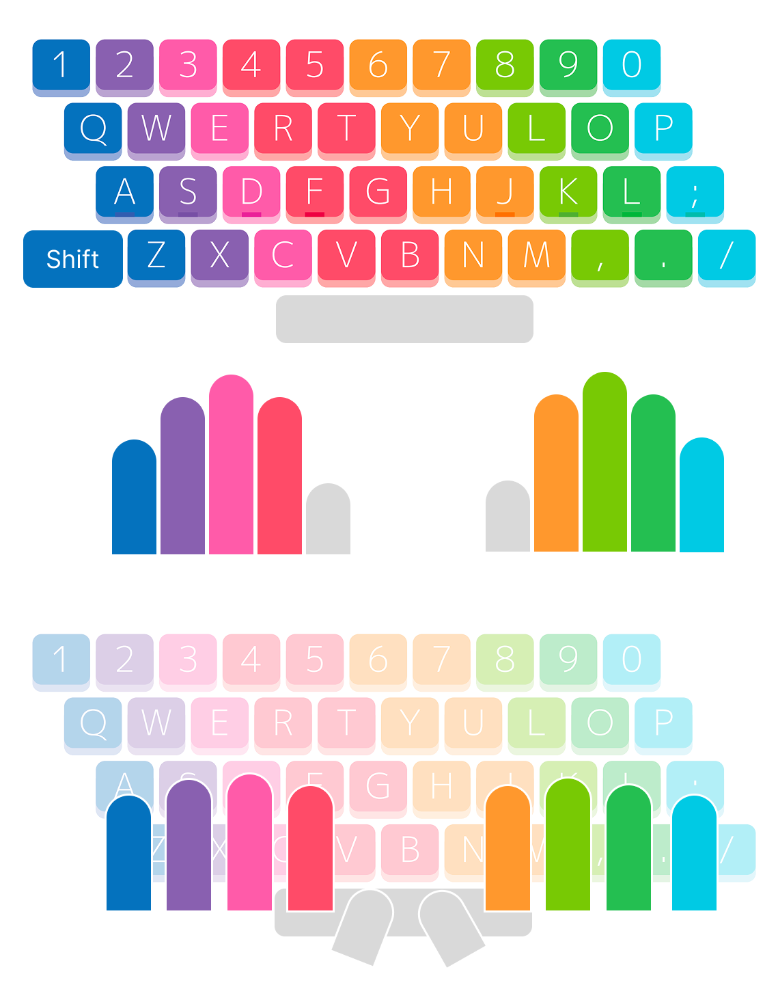


### ②タイピング練習

---

#### **【⭐️演習①⭐️】**

自己紹介ファイルを開いて、  
次の文章をタイピングしましょう

```html

はじめまして。わたしの名前はTaroです。  
16歳です。  
東京に住んでいます。

好きなことはゲームと音楽です。  
I like playing games and listening to music.

<自己紹介プログラム>  
name = "Taro"  
age = 16  

print("My name is " + name)  
print("I am " + str(age) + " years old")  

これからタイピングをがんばります！  
よろしくお願いします。

```

タイピングが終わったら、保存します。

---

#### **【⭐️演習②⭐️】**

(  )の中を自分の情報に書き換えてみよう

```html

はじめまして。わたしの名前は(  )です。  
(  )歳です。  
(  )に住んでいます。

好きなことは(  )と(  )です。  
I like (  ) and (  ).

＜自己紹介プログラム＞  
name = "(  )"  
age = (  )  

print("My name is " + name)  
print("I am " + str(age) + " years old")  


```

タイピングが終わったら、保存します。

## 4.googleアカウントを作る

### ①chromeインストール・設定

ブラウザ・・・Webサイトを閲覧することができるアプリ  

https://www.google.com/intl/ja_jp/chrome/

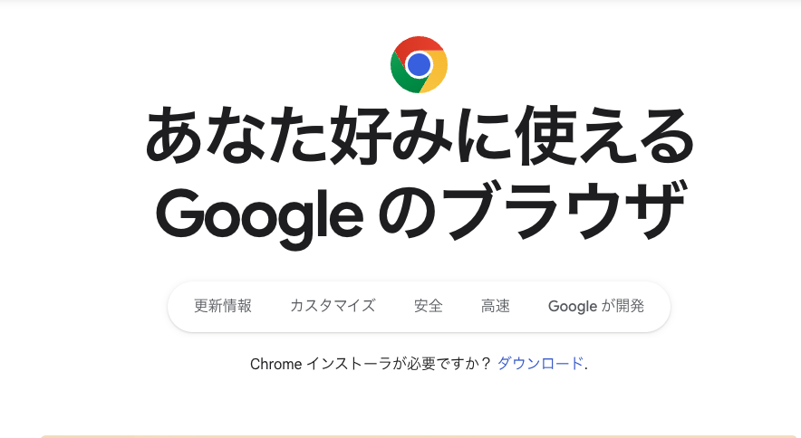

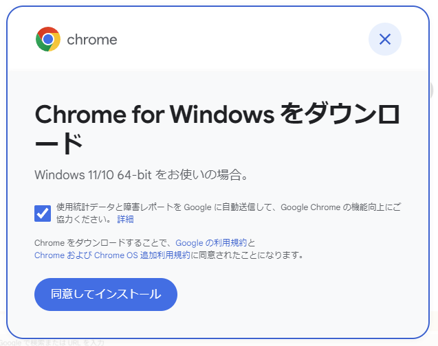

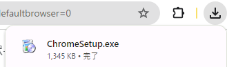

### ②googleアカウントの作成

googleのアカウント「XXXX@gmail.com」のアドレスを持っていない人は作りましょう。  

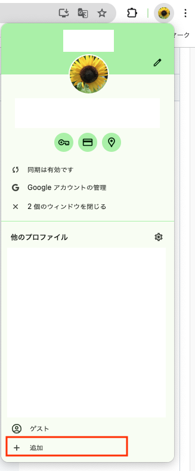

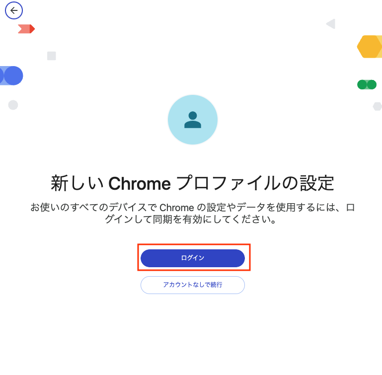

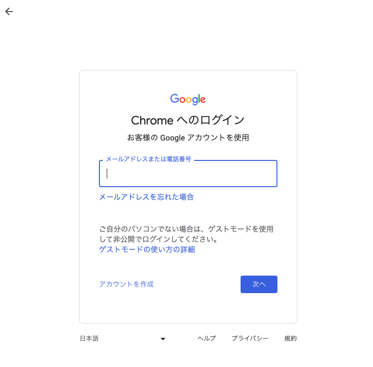
