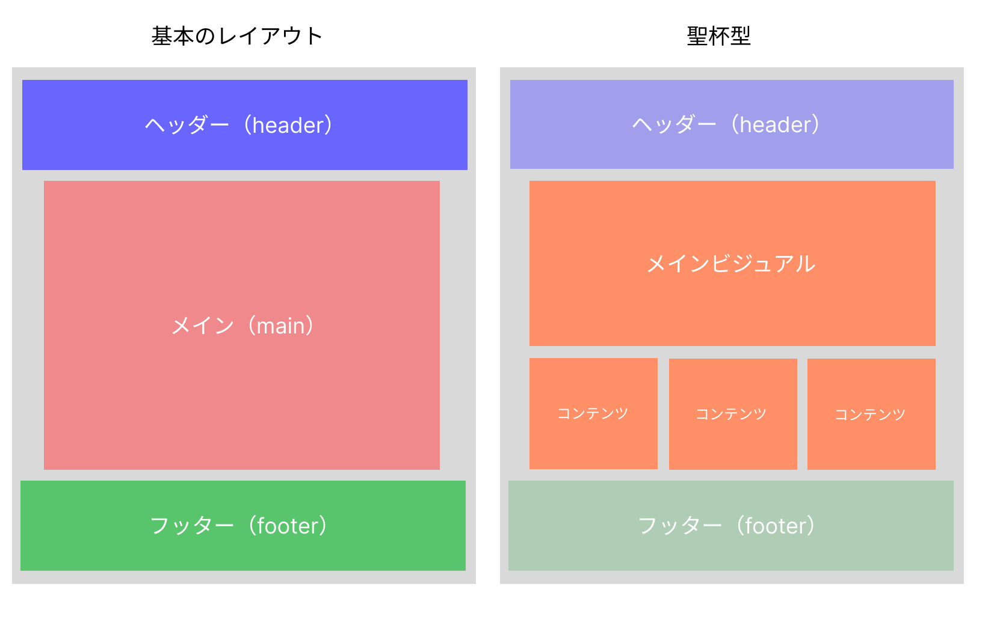
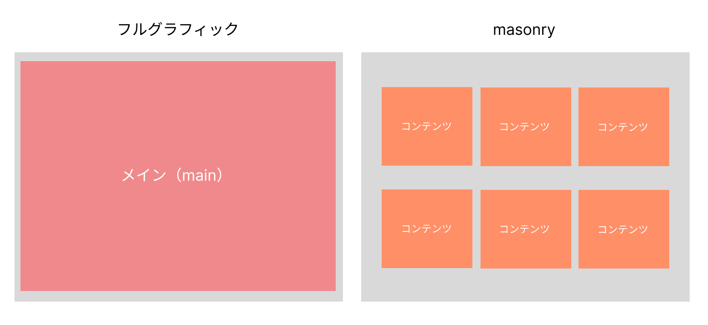
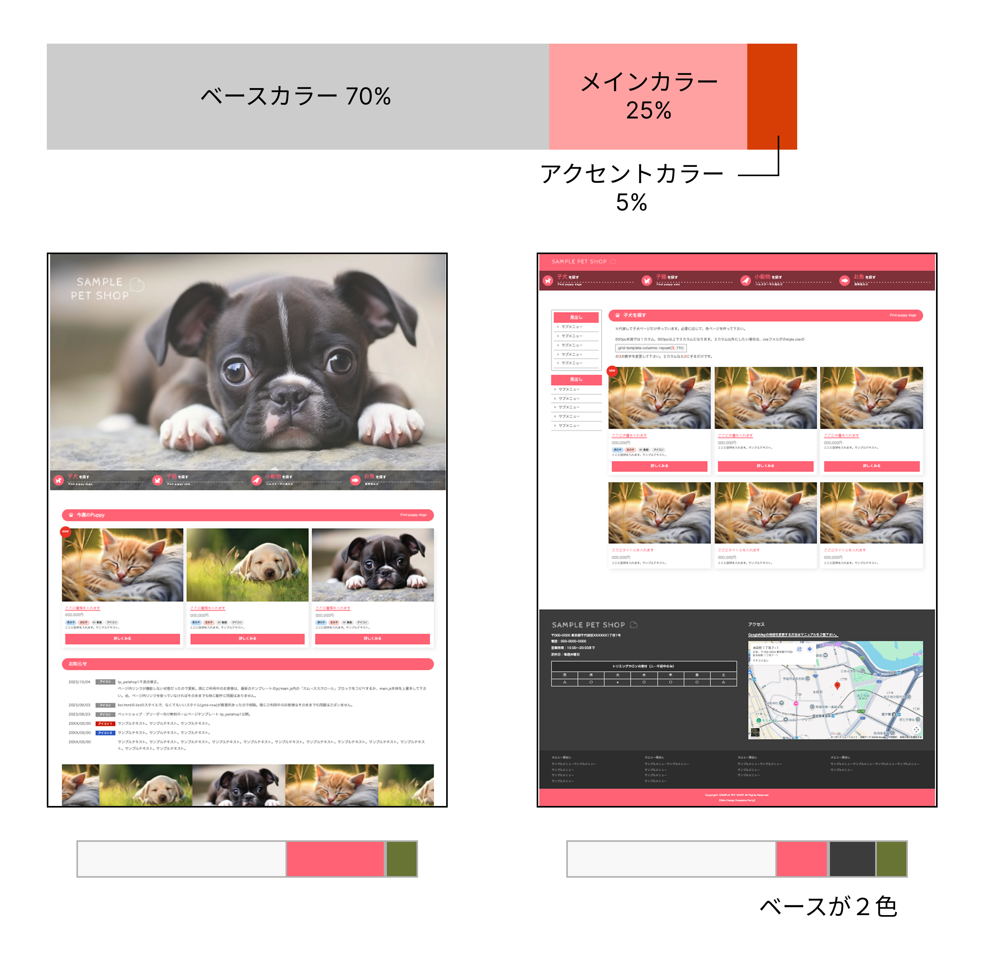

# **02_Webデザインの基礎**

## **1.この単元でやること**

1. レイアウトの基本
2. 余白の基本
3. 配色の基本
4. 演習

## **2.レイアウトの基本**




---

#### **【⭐️演習①⭐️】**

```html

下のサイトで、いろいろなレイアウトを探してみよう！！  
好きなレイアウトを１つ選んで、どんなところが好きか教えてください。

```

https://template-party.com/

---

## **3.デザインをチェックしてみよう**

#### **【⭐️演習②⭐️】**

```html

サンプルのサイトを見て、改善点を見つけよう

```

https://webgakushu.com/TRY/portal/final/compare/index.html

## **4.配色の基本と余白の基本**

### **配色のルール「3色・見やすく・統一する」**

- 色は3色までにする（ベースカラー、メインカラー、アクセントカラー）
- ベースカラーはシンプルにする
- アクセントカラーは少しだけ使う
- 文字は読みやすい色にする
- 色の役割を決めて統一する




【参考サイト】  
https://tsutawarudesign.com/miyasuku5.html

### **余白のルール「詰めない・そろえる・まとめる」**

- 1ページに1つの内容（多くても2つ）
- 要素と要素の間にスペースをあける
- グループごとにまとめる
- 余白の大きさをそろえる
- 内側の余白


【参考サイト】  
https://tsutawarudesign.com/miyasuku4.html

## **5.復習**

#### **【⭐️演習③⭐️】**

演習①で選んだレイアウトを見て考えてみよう

```html

レイアウトの特徴は？
メインカラー、ベースカラー、アクセントカラーはなに？
余白、配置が整理されているか？

```