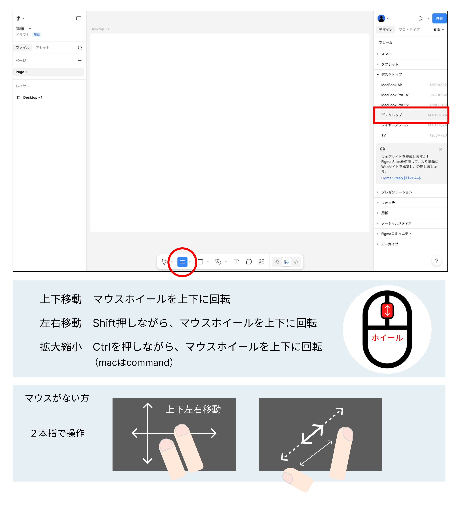
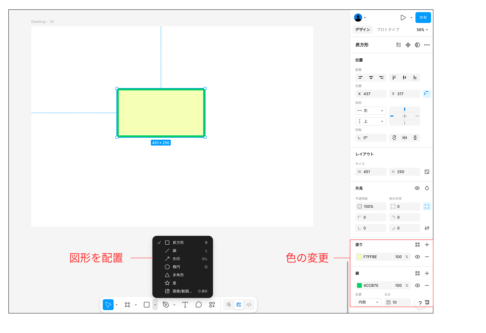
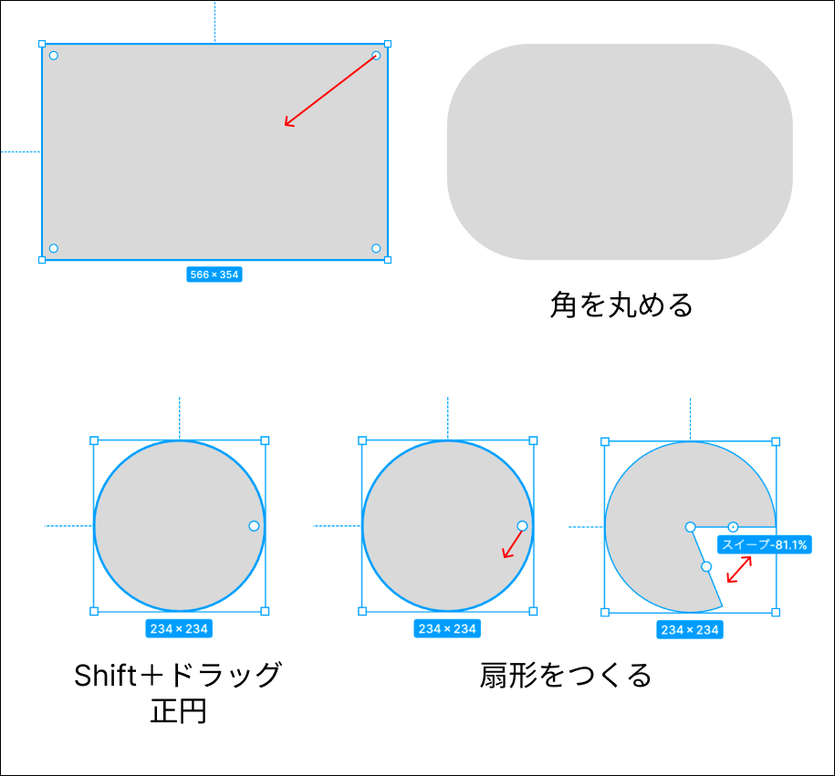
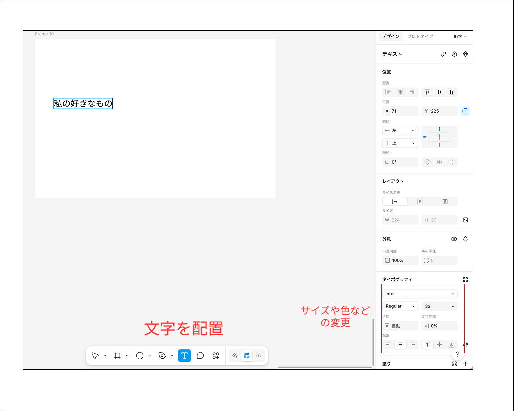
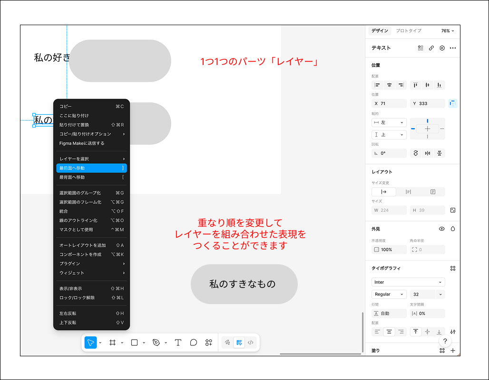
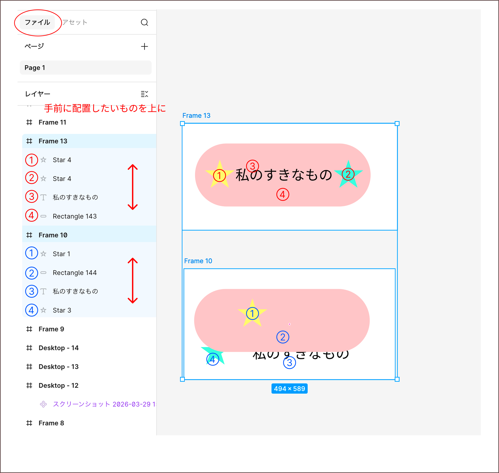
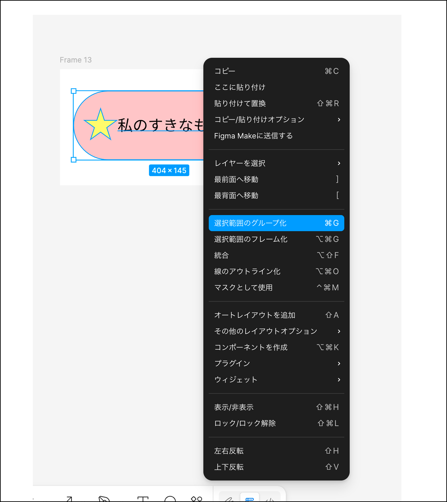
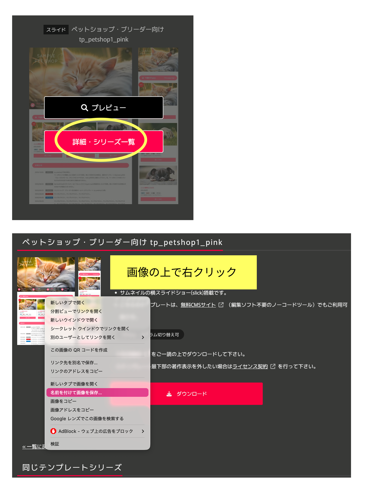
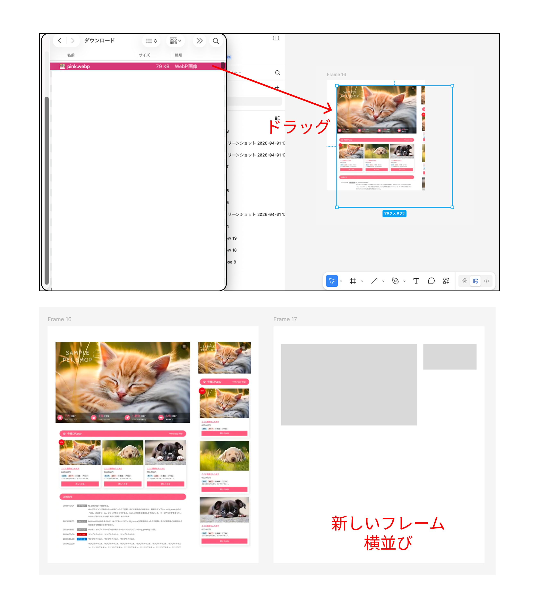
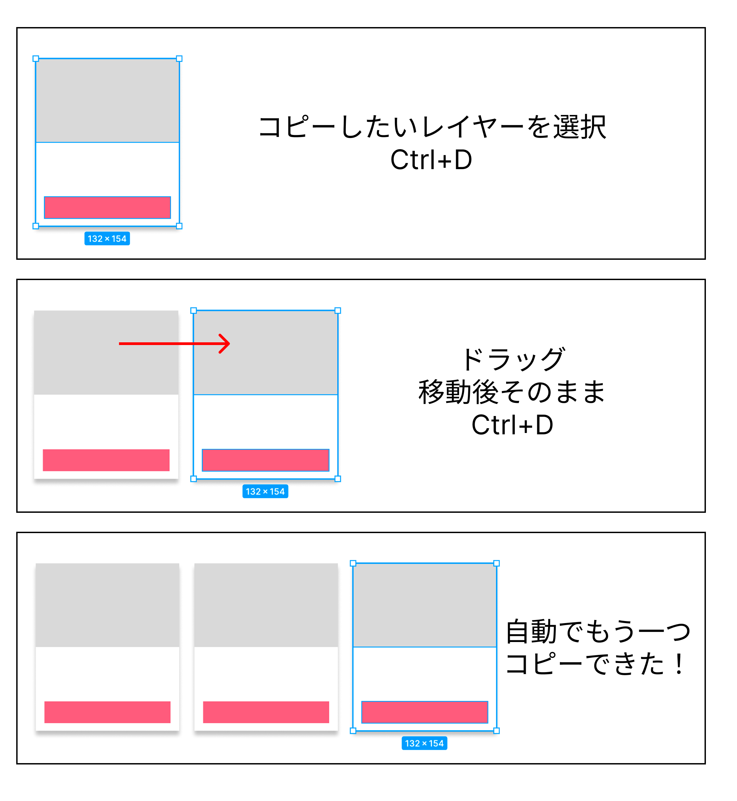

# **03_Figmaの使い方**

## **1.この単元でやること**

1. ログイン
2. 基本操作
3. 参考サイトから再現
4. 画像ダウンロード

## **2.Figmaにログインしよう**

https://www.figma.com/

## **3.基本操作**

**①フレーム**

フレームを選択  
figmaのフィールドを上下左右に移動したり、拡大縮小してみよう

**②図形と文字**

**③レイヤー**

レイヤーバーから変更することもできます。

**④グループ化**

組み合わせたレイヤーを1つのグループにまとめることができます。  
配置移動が簡単になります。  
グループ化したいレイヤーを選択（ドラッグ）→右クリック

## **4.再現してみよう**

「02_Webデザインの基礎」で選択したサイトを再現してみよう

**①Webサイトから画像を取得**

取得したい画像の上で右クリック　→ 「名前を付けて画像を保存」  
「ダウンロード」フォルダを選んで、「保存」する

**②figmaへ貼り付ける**

「ダウンロード」フォルダから、figmaへファイルをドラッグ  
新しい「フレーム」を横並びにして、同じレイアウトを作ってみよう

**③レイヤーをコピー**

