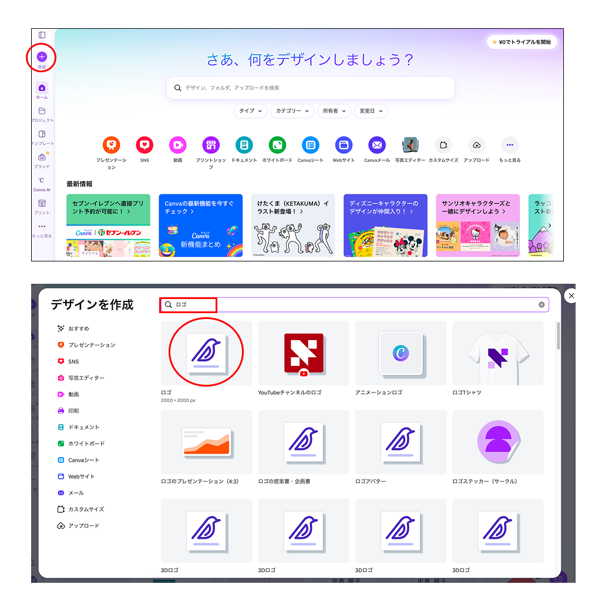
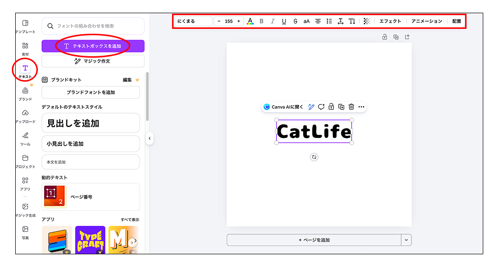
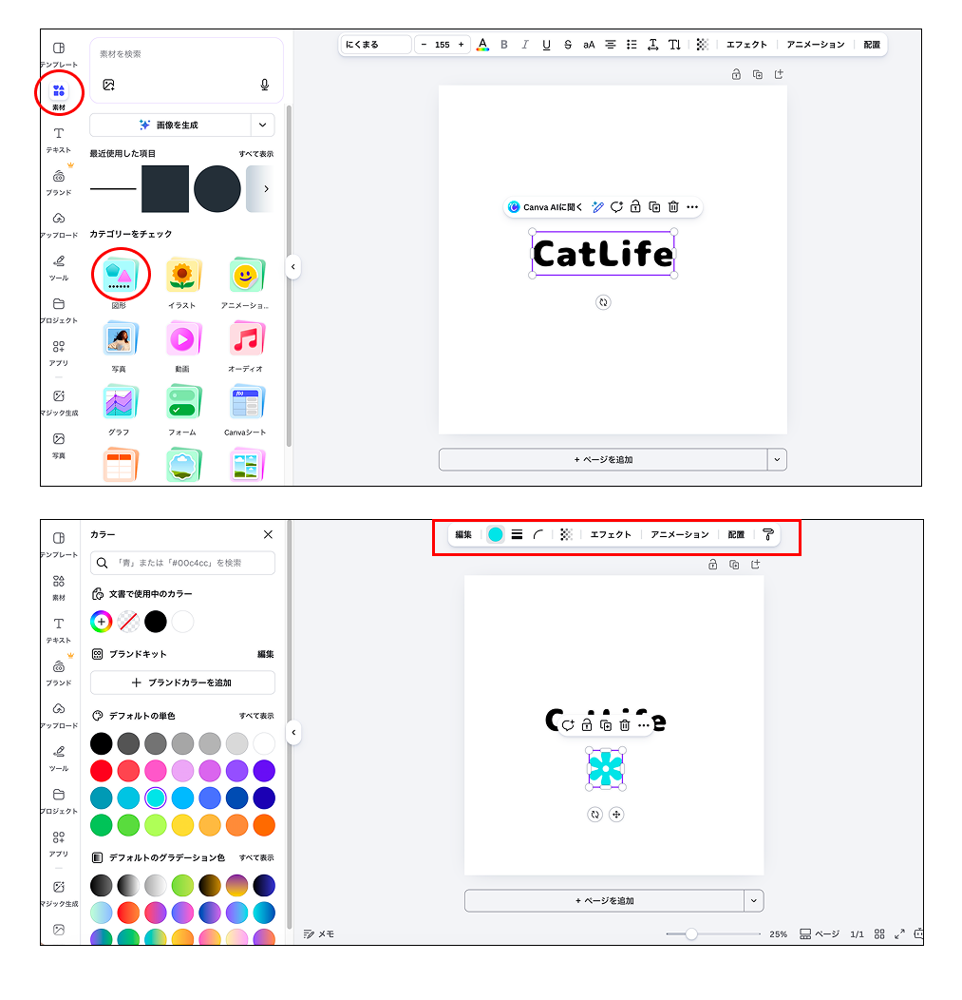
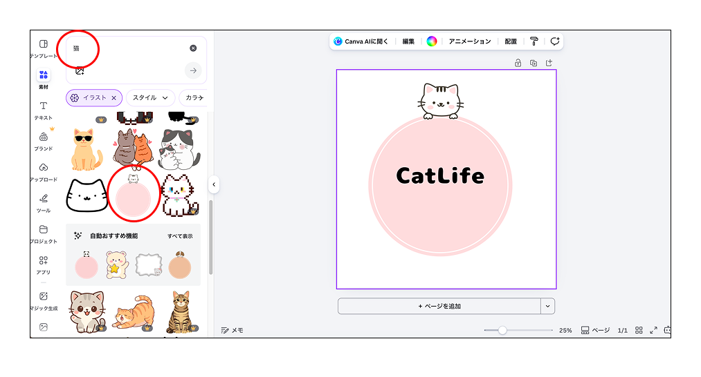
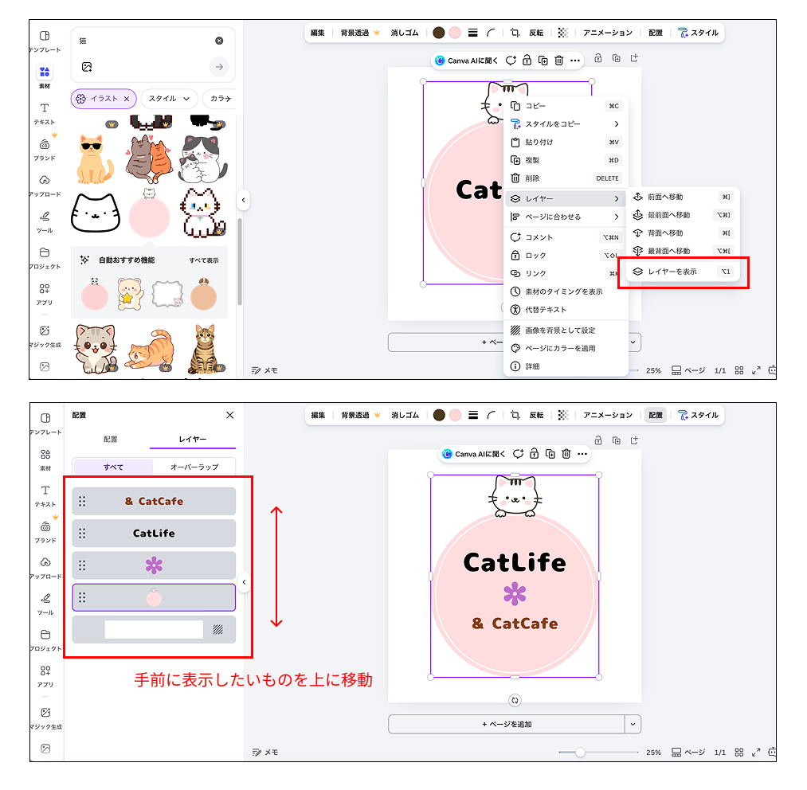
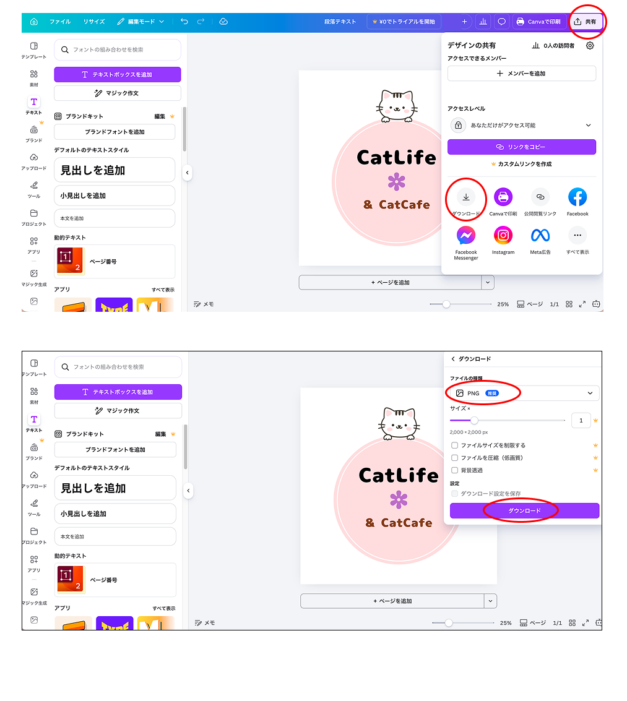

# **04_Canvaの使い方**

## **1.この単元でやること**

1. ログイン
2. 基本操作
3. オリジナルのロゴを作る
4. 画像をダウンロード

## **2.Canvaにログインしよう**

https://www.canva.com/

## **3.基本操作**

ロゴの作り方  

**①文字を入れる**

#### **【⭐️演習①⭐️】**

- 文字の種類を変更
- 文字の色を変更
- 文字の大きさを変更

**②図形を入れる**

#### **【⭐️演習②⭐️】**

- 図形を入れて色や大きさを変更

**③イラストを入れる**

#### **【⭐️演習③⭐️】**

- イラストを配置
- レイヤーの変更

**④画像をダウンロード**

作ったロゴを画像ファイルとしてダウンロードできます。

