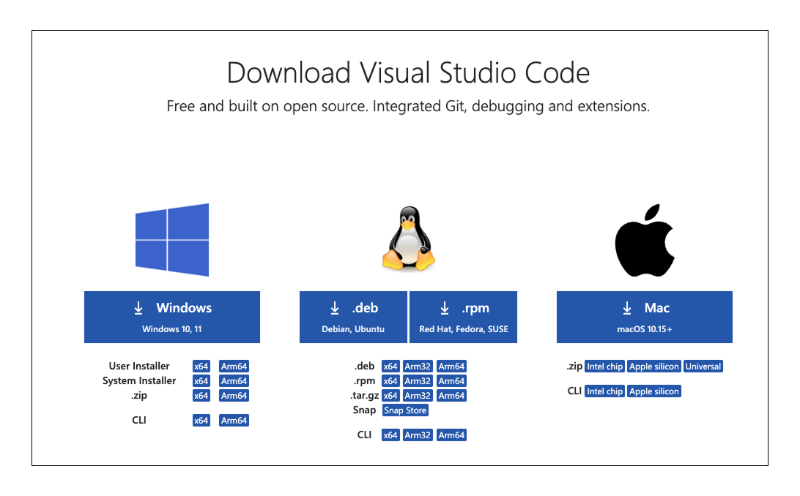
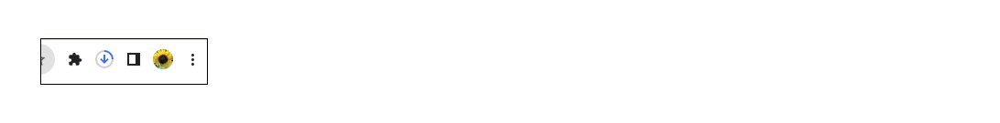
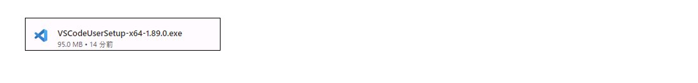
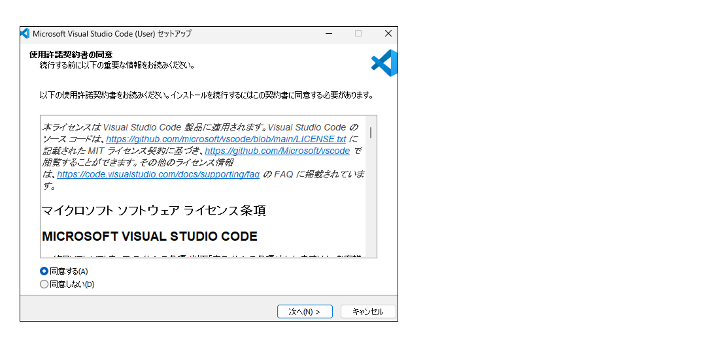
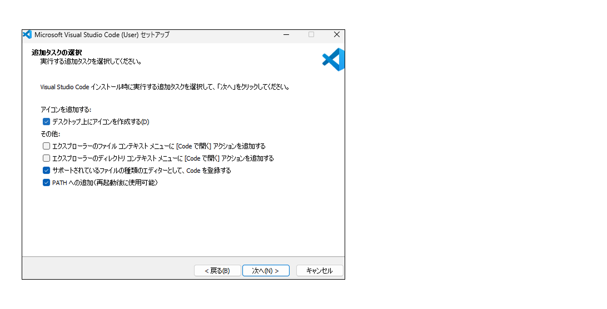
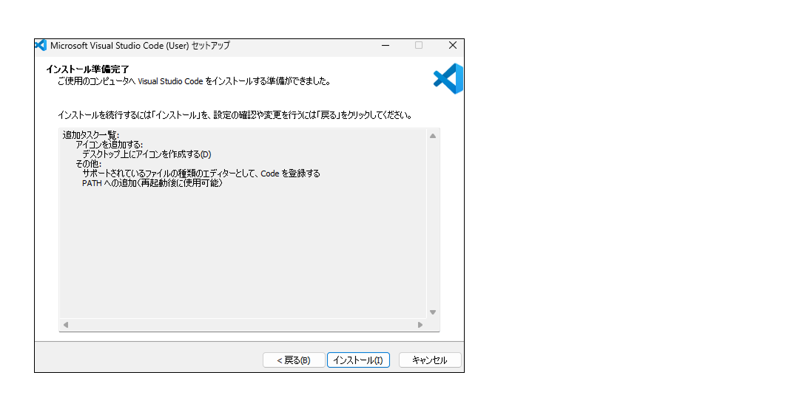
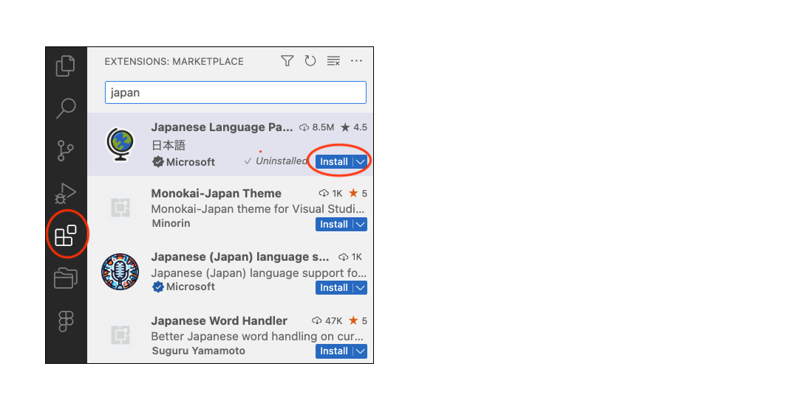
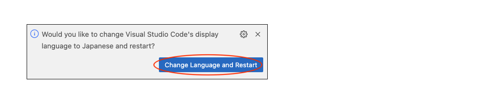
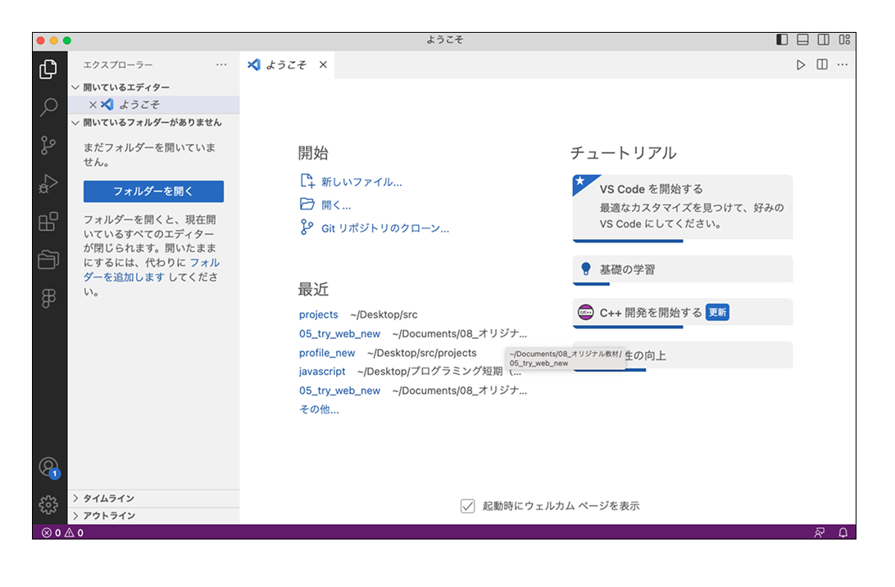

# **06_HTMLとCSSの基礎**

## **1.この単元でやること**

1. HTMLとCSSを体験してみよう
2. VSCodeのインストール

## **2.HTMLとCSSを体験してみよう**

https://webgakushu.com/TRY/trial1/trial1/trial1.html

## **3.VSCodeのインストール**

https://code.visualstudio.com/download

**①自分のパソコンのOSに合ったインストーラーを使用**

クリックするとダウンロードが自動で始まります

**②画面右上（または左下）のアイコンでダウンロードの進行状況が確認できます**

**③ダウンロードが終わるとexeファイルが表示されるのでクリックしてインストールします**

**④「同意する」にチェック「次へ」**

**⑤「デスクトップ上にアイコンを作成する」にチェック「次へ**

**⑥「インストール」**

**⑦日本語化**

