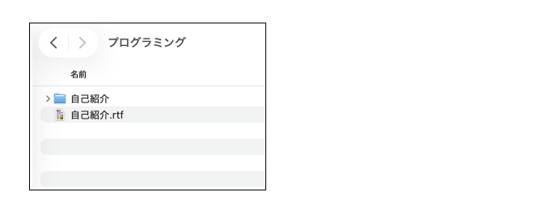
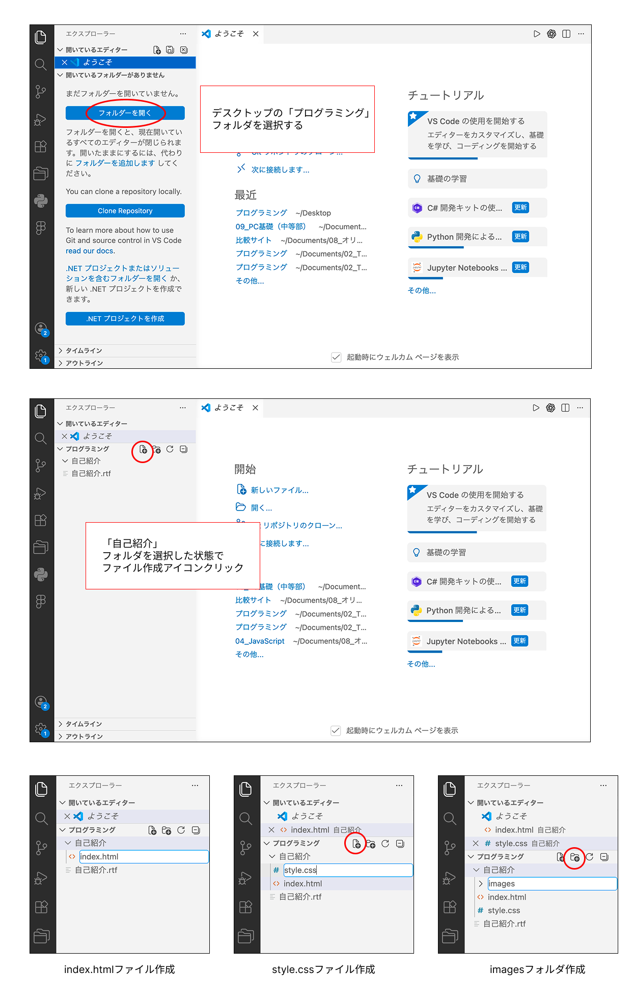
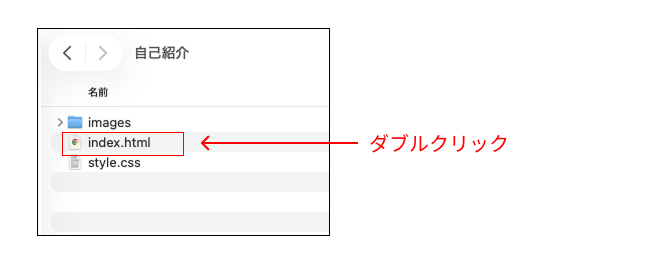
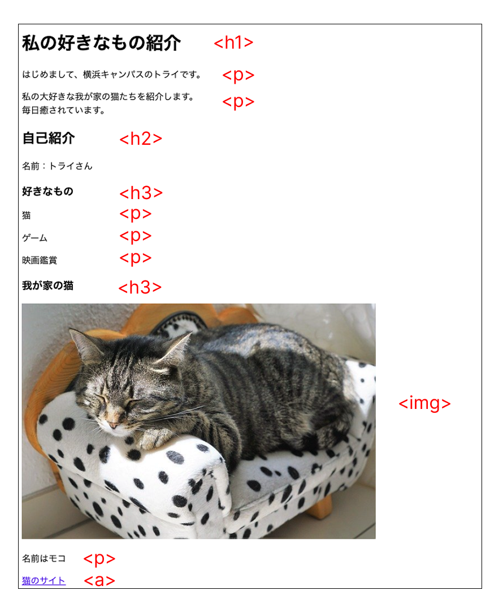

# **07_08_webサイト演習**

figmaで作ったデザインを元にサイトをつくろう

## **1.この単元でやること**

1. フォルダとファイルを作る
2. 自己紹介サイトをつくる

## **2.フォルダとファイルを作る**

**①「自己紹介」フォルダを作成**

「プログラミング」フォルダ内に「自己紹介」フォルダを作成



**②VSCode上でファイルとフォルダを作成**

「自己紹介」フォルダの中に  
「index.html」と「style.css」ファイルを作成  
「images」フォルダを作成  



## **3.基本のコードを書く**

**【index.html】**

```html

<!DOCTYPE html>
<html lang="ja">
    <head>
        <meta charset="UTF-8">
        <title>自己紹介</title>
        <link rel="stylesheet" href="style.css">
    </head>
    <body>
        
    </body>
</html>

```

**ファイルを保存して、ブラウザで表示**

VSCode上で　Ctrl+S で保存  
index.htmlをダブルクリックで開く




## **4.タグを書いてみよう**

自分のデザインに合わせてタグを書いてみよう  
bodyタグの中に書きます

**①見出しのタグ**

h1~h6まで  
「大見出し」「中見出し」「子見出し」・・・優先度の高い見出し順

```html

<h1>私の好きなもの紹介</h1>
<h2>自己紹介</h2>
<h3>我が家の猫</h3>

```

**②文字のタグ**

pタグ・・・段落  
brタグ・・・改行

```html

<p>はじめまして、横浜キャンパスのトライです。</p>
<p>
    私の大好きな我が家の猫たちを紹介します。<br>
    毎日癒されています。
</p>

```

**③画像のタグ**

imagesフォルダに画像を入れる  
imgタグ・・・画像を表示

下の「cat01.png」の部分を自分が入れが画像のファイル名に変更する

```html


```

**④リンクのタグ**

aタグ・・・リンク  
hrefの中にリンク先のURLを入れる

```html

<a href="https://www.nekobu.com/" target="_blank">猫のサイト</a>

```



## **5.CSSを書いてみよう**

**①背景色を指定**

style.cssの中に書く

```css

body {
    background-color: #fffbe4;
}

```

**②文字色を指定**

```css

p {
    color: rgb(0, 56, 152);
}

h1 {
    color: rgb(0, 159, 216);
}

```

**③配置を変える**

```css

body {
    background-color: #fffbe4;
    text-align: center;     ←これ
}

```

**④幅の変更**

```css

img {
    width: 30%;
}

```


### **やってみたいことがあれば、先生にきいてみよう！！！！**